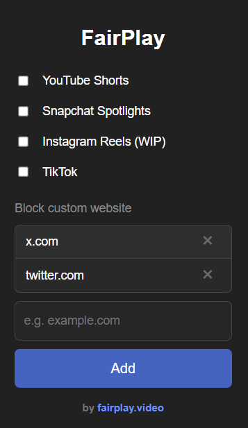

  

# Vertical Content Blocker

A lightweight browser add-on for Chromium and Firefox designed to help you take back control of your attention.

It lets you:

* **Remove** YouTube Shorts, Snapchat Spotlights, and (soon) Instagram Reels
* **Completely block** TikTok or any custom website you choose

## Install

* **Chromium (Chrome, Edge)**: [Download from the Microsoft Edge Add-ons Store](https://microsoftedge.microsoft.com/addons/detail/antivertical-content/aafojaecolkacnnbkmodafapbcbcapkb)
* **Firefox**: Coming soon!
  Meanwhile, you can still install it manually by following the developer setup below.

## Installation for Developers

1. **Download** or clone this repository.
2. If you're installing for Firefox, rename `manifest.firefox.json` to `manifest.json`.
   For Chromium, do the same with the Chromium version of the manifest.
3. Load the extension in **developer mode**:

   * **Chrome / Edge**: Menu → **Add-ons** → **Load unpacked extension** → select the project folder.
   * **Firefox**: Navigate to `about:debugging` → **This Firefox** → **Load Temporary Add-on** → choose `manifest.json`.
4. You're all set — the extension is now active!

## Configuration & Usage

1. Click the extension icon in your browser toolbar.
2. Toggle the filters you want:

   * **YouTube Shorts**
   * **Instagram Reels** *(WIP)*
   * **Snapchat Spotlights**
   * **TikTok**
3. Add or remove a custom website:

   * Enter a domain name (e.g. `example.com`), then click **Add**.
   * Your changes apply instantly.

## License

MIT © 2025 - free to use, modify, and contribute.